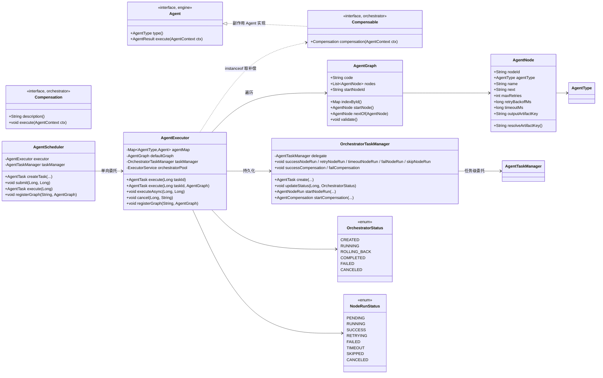
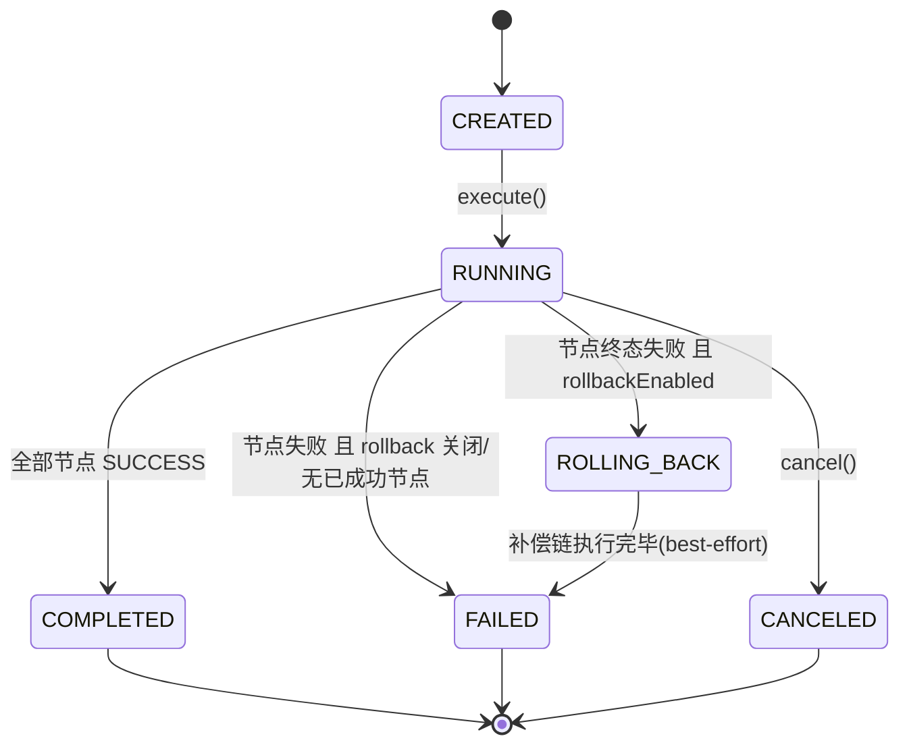
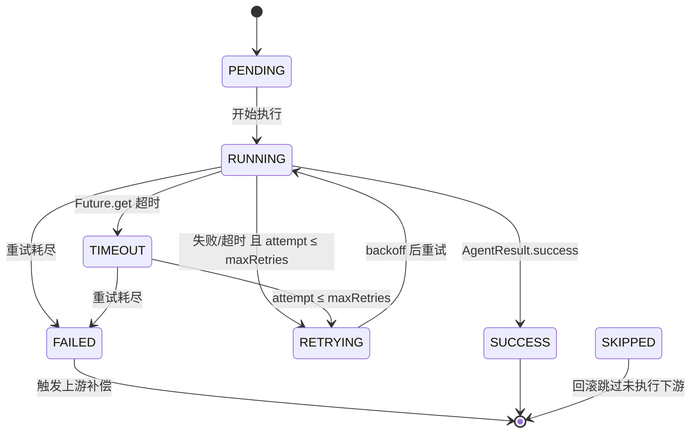
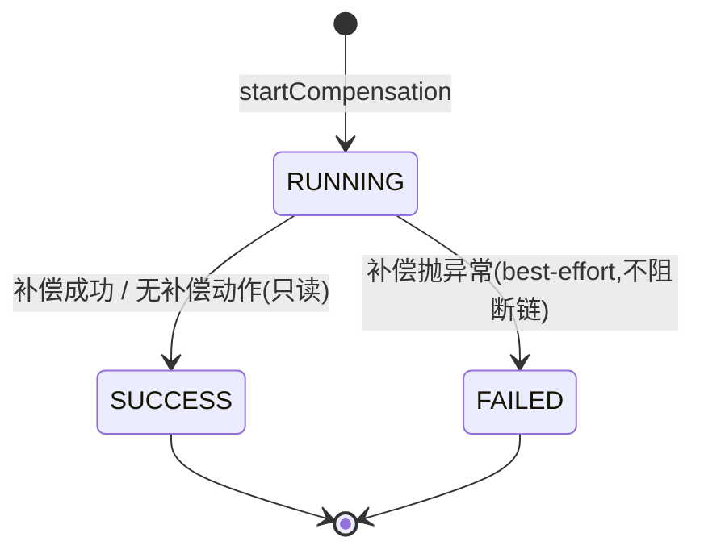
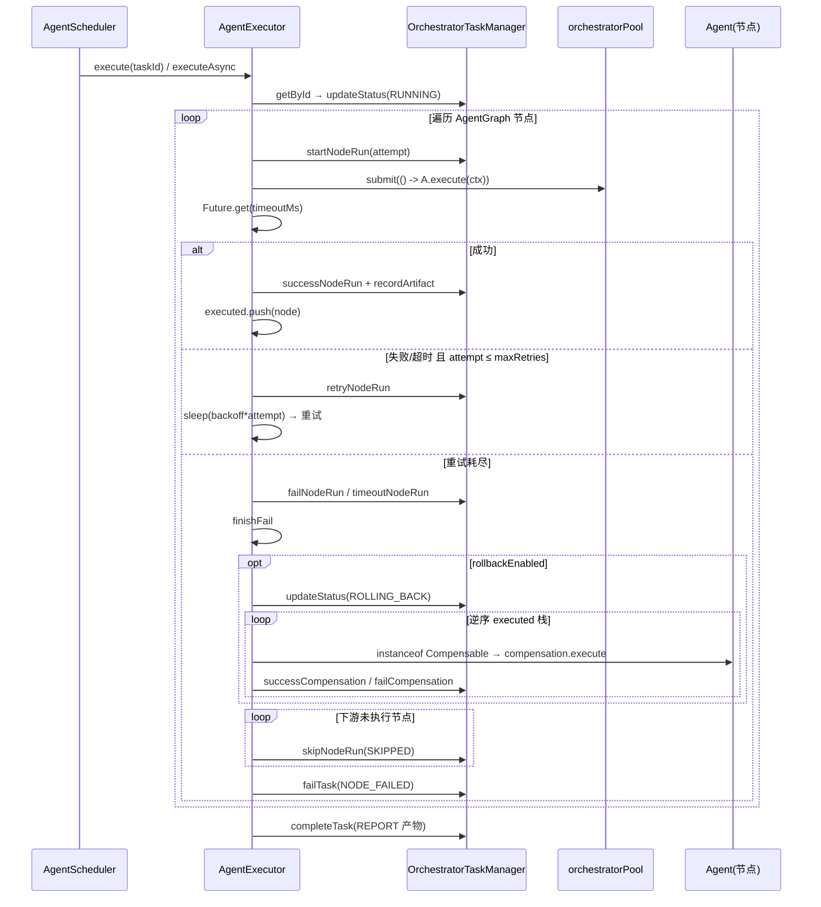

# Agent 编排引擎设计文档（v3-4）

> 模块：`knowledge-agent` / 包：`com.knowledge.agent.orchestrator`
> 实现：Agent 注册、图编排、状态机、重试、Saga 补偿回滚、硬超时

## 1. 定位

与现有两层执行引擎并列共存，补齐 **重试 + 回滚 + 硬超时** 三大能力：

| 层 | 类 | 模型 | 重试 | 回滚 | 超时 |
|---|---|---|---|---|---|
| `engine` | `AgentExecutor` | 固定 4 步线性 | ✗ | ✗ | 步间软校验 |
| `workflow` | `WorkflowExecutor` | 声明式 TOOL/LLM 节点 | ✓ | ✗ | ✗ |
| **`orchestrator`** | **`AgentExecutor`** | **Agent 图（顺序+分支）** | **✓** | **✓ Saga** | **✓ 硬超时** |

复用 `engine.Agent`/`AgentContext`/`AgentResult`/`AgentTaskManager` 与 `agent_task` 表；新增 `agent_node_run` + `agent_compensation` 两表。

## 2. 类图



**依赖方向**：`orchestrator → engine`（单向）。补偿通过 `Compensable` 标记接口 + `instanceof` 判定，**不修改 `engine.Agent`**，保持 engine 零侵入。`AgentScheduler → AgentExecutor` 单向，避免循环依赖（默认图由 `AgentExecutor.@PostConstruct` 从注入的 `List<Agent>` 自动构建）。

## 3. 状态机

### 3.1 任务级（`OrchestratorStatus`，写入 `agent_task.status`）



### 3.2 节点级（`NodeRunStatus`，写入 `agent_node_run.status`）



### 3.3 补偿（写入 `agent_compensation.status`）



## 4. 执行流程



## 5. 核心决策

1. **共存不替换**：新建 `orchestrator` 包，不动 `engine.AgentExecutor`/`workflow.WorkflowExecutor`。`AgentExecutor` 同名不同包（`com.knowledge.agent.orchestrator`），FQN 区分。
2. **engine 零侵入**：补偿通过 `Compensable` 接口（`instanceof`）扩展，不修改 `engine.Agent`，依赖方向 `orchestrator → engine`。
3. **图模型=顺序+分支**：`AgentNode.next` 显式跳转实现分支，无并行调度（避免线程安全复杂度）。默认图由 `List<Agent>` 按 `@Order` 自动构建为 Planner→Knowledge→Analysis→Report→END。
4. **回滚=Saga 补偿链**：逆序执行已 SUCCESS 节点的 `Compensation`，best-effort 不阻断链；无副作用 Agent 记空补偿 SUCCESS 保证审计完整。
5. **持久化=新增两表**：`agent_node_run`（含 attempt/timeout/retry/skip 状态）+ `agent_compensation`，复用 `agent_task` 做任务级。
6. **超时=Future.cancel(true)**：硬中断 best-effort；LLM 阻塞调用响应中断取决于底层 HTTP 客户端，无可中断时退化为下节点前 wall-clock 软校验兜底。
7. **任务状态字符串共存**：`agent_task.status` 为 VARCHAR，编排层写 `OrchestratorStatus`（RUNNING/ROLLING_BACK 等），与 engine 层 EXECUTING 不冲突（一任务仅经一层执行）。

## 6. 配置

```yaml
agent:
  orchestrator:
    default-max-retries: 1          # 节点默认额外重试次数（不含首次）
    default-retry-backoff-ms: 500   # 重试退避（实际等待 = backoff * attempt）
    default-node-timeout-ms: 120000 # 节点默认硬超时（0=不限）
    executor-pool-size: 4           # 编排执行线程池大小
    rollback-enabled: true          # 是否启用补偿回滚
```

节点级策略优先取自 `AgentNode`，默认图构建时套用配置默认值；自定义图节点值按字面值生效（`maxRetries=0` 不重试，`timeoutMs=0` 不限）。

## 7. 验证

- 单元测试 25 个全绿：`AgentGraphTest`(11) + `AgentSchedulerTest`(7) + `AgentExecutorTest`(7，覆盖全成功/重试后成功/重试耗尽回滚/硬超时/下游跳过/回滚关闭/补偿链 best-effort)。
- 全模块 139 个测试零回归。
- `orchestrator_schema.sql` 可在 MySQL8 独立建表。
